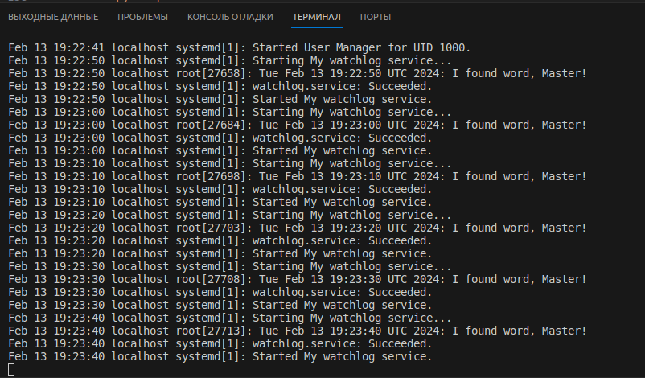

# Домашнее задание: Systemd - создание unit-файла

Цель:
научиться редактировать существующие и создавать новые unit-файлы;

---

## Решение:

Задание выполнено на машине vagrant с помощью Ansible.

Скрипт `deploy.sh`:
 - создаёт виртуальную машину с помощью Vagrantfile;
 - заускает роль, которая выполняет действия над машиной согласно заданию и записывает каждый шаг в лог;
 - получает лог из виртуальной машины. 

Файл с логом, полученный после отработки роли находится в директории со скриптом `deploy.sh`

<details>
<summary>Содержимое лога</summary>

```bash


 Посмотрим состояние сервиса spawn-fcgi 

● spawn-fcgi.service - Spawn-fcgi startup service by Otus
   Loaded: loaded (/etc/systemd/system/spawn-fcgi.service; enabled; vendor preset: disabled)
   Active: active (running) since Tue 2024-02-13 19:19:43 UTC; 664ms ago
 Main PID: 9486 (php-cgi)
    Tasks: 33 (limit: 1133)
   Memory: 30.4M
   CGroup: /system.slice/spawn-fcgi.service
           ├─9486 /usr/bin/php-cgi
           ├─9558 /usr/bin/php-cgi
           ├─9559 /usr/bin/php-cgi
           ├─9560 /usr/bin/php-cgi
           ├─9561 /usr/bin/php-cgi
           ├─9562 /usr/bin/php-cgi
           ├─9563 /usr/bin/php-cgi
           ├─9564 /usr/bin/php-cgi
           ├─9565 /usr/bin/php-cgi
           ├─9566 /usr/bin/php-cgi
           ├─9567 /usr/bin/php-cgi
           ├─9568 /usr/bin/php-cgi
           ├─9569 /usr/bin/php-cgi
           ├─9570 /usr/bin/php-cgi
           ├─9571 /usr/bin/php-cgi
           ├─9572 /usr/bin/php-cgi
           ├─9573 /usr/bin/php-cgi
           ├─9574 /usr/bin/php-cgi
           ├─9575 /usr/bin/php-cgi
           ├─9576 /usr/bin/php-cgi
           ├─9579 /usr/bin/php-cgi
           ├─9580 /usr/bin/php-cgi
           ├─9581 /usr/bin/php-cgi
           ├─9582 /usr/bin/php-cgi
           ├─9583 /usr/bin/php-cgi
           ├─9584 /usr/bin/php-cgi
           ├─9585 /usr/bin/php-cgi
           ├─9586 /usr/bin/php-cgi
           ├─9587 /usr/bin/php-cgi
           ├─9588 /usr/bin/php-cgi
           ├─9589 /usr/bin/php-cgi
           ├─9590 /usr/bin/php-cgi
           └─9591 /usr/bin/php-cgi

Feb 13 19:19:43 unitMachine systemd[1]: Started Spawn-fcgi startup service by Otus.


 Посмотрим лог 

Feb 13 19:20:45 localhost systemd[1]: Stopping /run/user/1000 mount wrapper...
Feb 13 19:20:45 localhost systemd[1]: Removed slice User Slice of UID 1000.
Feb 13 19:20:45 localhost systemd[1]: run-user-1000.mount: Succeeded.
Feb 13 19:20:45 localhost systemd[1]: user-runtime-dir@1000.service: Succeeded.
Feb 13 19:20:45 localhost systemd[1]: Stopped /run/user/1000 mount wrapper.
Feb 13 19:20:45 localhost systemd[1]: Created slice User Slice of UID 1000.
Feb 13 19:20:45 localhost systemd[1]: Started /run/user/1000 mount wrapper.
Feb 13 19:20:45 localhost systemd[1]: Starting User Manager for UID 1000...
Feb 13 19:20:45 localhost systemd[1]: Started Session 8 of user vagrant.
Feb 13 19:20:45 localhost systemd-logind[724]: New session 8 of user vagrant.
Feb 13 19:20:45 localhost systemd[25705]: Starting D-Bus User Message Bus Socket.
Feb 13 19:20:45 localhost systemd[25705]: Reached target Paths.
Feb 13 19:20:45 localhost systemd[25705]: Started Mark boot as successful after the user session has run 2 minutes.
Feb 13 19:20:45 localhost systemd[25705]: Reached target Timers.
Feb 13 19:20:45 localhost systemd[25705]: Listening on D-Bus User Message Bus Socket.
Feb 13 19:20:45 localhost systemd[25705]: Reached target Sockets.
Feb 13 19:20:45 localhost systemd[25705]: Reached target Basic System.
Feb 13 19:20:45 localhost systemd[25705]: Reached target Default.
Feb 13 19:20:45 localhost systemd[25705]: Startup finished in 57ms.
Feb 13 19:20:45 localhost systemd[1]: Started User Manager for UID 1000.


 Посмотрим ss -tnulp | grep httpd 

tcp     LISTEN   0        128                    *:8080                *:*       users:(("httpd",pid=27121,fd=4),("httpd",pid=27120,fd=4),("httpd",pid=27119,fd=4),("httpd",pid=27118,fd=4),("httpd",pid=27115,fd=4))
tcp     LISTEN   0        128                    *:80                  *:*       users:(("httpd",pid=26803,fd=4),("httpd",pid=26802,fd=4),("httpd",pid=26801,fd=4),("httpd",pid=26798,fd=4),("httpd",pid=26795,fd=4))

```
</details>

Команда `tail -n 20 /var/log/messages` не показала часть лога, где содежится фраза `I found word, Master!`.

Поэтому результат получил подключившись к машине и выполнив ту же команду. Вывод на скриншоте:


